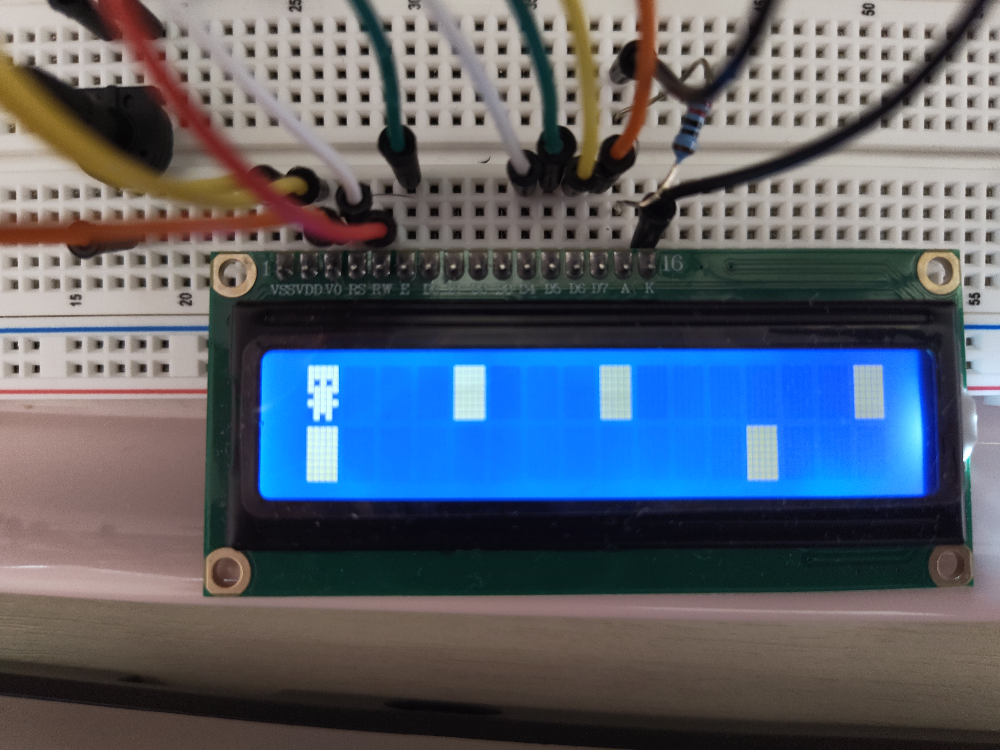

### Mini LCD Game
Simple whimsical LCD game project, without the use of any libraries for components.

## Setup
Components:
- Arduino Uno R3
- LCD1602 (HD44780)
- 2 Push Buttons

## Gameplay
Youtube Video:
